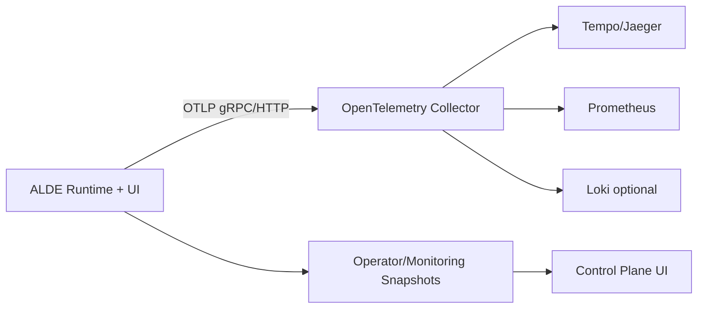

# OTEL Umbau Projektdokumentation

## 1. Ziel und Scope

Diese Dokumentation beschreibt den Umbau des bestehenden ALDE-Monitorings in Richtung echtes OpenTelemetry (OTel).

Scope:
- Traces, Metrics und optionale Logs standardisiert erzeugen
- Telemetrie via OTLP an einen OpenTelemetry Collector exportieren
- Bestehende Operator- und Monitoring-Snapshots beibehalten und schrittweise mit OTel-Signalen anreichern

Nicht im Scope:
- Kompletter UI-Neubau
- Austausch der bestehenden Snapshot-Services

---

## 2. Ist-Stand (bereits umgesetzt)

Aktuell ist bereits eine belastbare interne Monitoring-Basis vorhanden:

- Repo-Worker Liveness/Heartbeat und stale detection
- Monitoring-Snapshot inkl. Repo-Worker-Telemetrie
- Operator-Snapshot mit eigener Repo-Worker-Service-Row
- Kompakte Repo-Worker-Health-Badge im Operator-Header

Wichtige Stellen im Code:
- `ALDE/alde/control_plane_runtime.py`
- `ALDE/alde/repo_code_splitter.py`
- `ALDE/alde/ai_ide_v1756.py`
- `ALDE/alde/test_runtime_view.py`

Damit ist die fachliche Telemetrie vorhanden, aber noch nicht OTel-standardisiert exportiert.

---

## 3. Zielbild (Soll)

### 3.1 Architekturprinzip

1. ALDE erzeugt OTel-Telemetrie (Tracer + Meter) im Prozess.
2. Telemetrie wird per OTLP an den OTel Collector gesendet.
3. Der Collector verteilt an Backends:
   - Traces: Jaeger oder Tempo
   - Metrics: Prometheus/Grafana
   - Logs (optional): Loki
4. Die bestehende ALDE-UI bleibt Operator-Frontend und liest weiterhin Snapshots (plus spaeter OTel-abgeleitete Health-Signale).

### 3.2 High-Level Diagramm

---

## 4. Migrationsplan in Phasen

## Phase 0 - Stabilisierung (Done)

Ziel:
- Korrekte interne Health-Signale und Operator-Sicht herstellen

Status:
- Done

Ergebnis:
- Zuverlaessige Repo-Worker-Zustaende (running/failed/stale)
- Operator-Kachel und Monitoring-Zahlen konsistent

## Phase 1 - OTel Foundation (Next)

Ziel:
- OTel initialisieren, aber funktional noch ohne grossen Refactor

Umsetzung:
1. Neue Datei `ALDE/alde/observability_otel.py`
2. Initialisierung von:
   - `TracerProvider`
   - `MeterProvider`
   - OTLP Exporter
3. Resource-Attribute setzen:
   - `service.name=alde-control-plane`
   - `service.namespace=alde`
   - `service.version=<app_version>`
   - `deployment.environment=<dev/stage/prod>`
4. Feature-Flag via Env:
   - `ALDE_OTEL_ENABLED=1`

Abnahme:
- App startet unveraendert mit `ALDE_OTEL_ENABLED=0`
- Mit `ALDE_OTEL_ENABLED=1` werden erste Test-Spans exportiert

## Phase 2 - Tracing der Kernpfade

Ziel:
- Echte End-to-End Traces fuer Operator-relevante Ablaeufe

Umsetzung:
1. Root-Span pro Workflow-Run
2. Child-Spans fuer:
   - Tool Calls
   - Handoffs
   - Repo-Worker-Jobs
3. Attribute aus vorhandenen Feldern mappen:
   - `agent.label`
   - `workflow.name`
   - `tool.name`
   - `repo.job_id`
   - `repo.operation`

Abnahme:
- Trace in Jaeger/Tempo zeigt Parent/Child-Struktur
- Fehlerfaelle enthalten Status + Error Events

## Phase 3 - Metrics Instrumentierung

Ziel:
- Vorhandene Snapshot-Metriken als OTel Metrics publizieren

Umsetzung:
1. Gauges/Counters/Histograms definieren
2. Mapping der bestehenden Werte in OTel-Namen
3. Export via OTLP

Beispiel-Metriken:
- `alde.repo_worker.jobs.total`
- `alde.repo_worker.jobs.active`
- `alde.repo_worker.jobs.stale_active`
- `alde.repo_worker.heartbeat.max_age_seconds`
- `alde.operator.alerts.count`
- `alde.mcp.latency.ms` (Histogram)

Abnahme:
- Metriken in Prometheus/Grafana sichtbar
- Werte stimmen mit Snapshot-UI ueberein

## Phase 4 - Log Correlation (optional, empfohlen)

Ziel:
- Logs mit Trace/Span-Kontext korrelieren

Umsetzung:
1. Logging-Formatter um `trace_id` und `span_id` erweitern
2. Optional OTel-Logexport aktivieren

Abnahme:
- Log-Zeilen sind in Grafana/Loki auf Trace drilldown-faehig

## Phase 5 - Dashboards, SLOs und Alerts

Ziel:
- Produktionsreife Operability

Umsetzung:
1. Dashboards:
   - Repo Worker Health
   - MCP Latenz/Fehler
   - Workflow Success/Failure
2. Alerts:
   - stale jobs > 0
   - heartbeat age > Schwellwert
   - MCP timeout rate > Schwellwert

Abnahme:
- Alerts feuern reproduzierbar in Testfaellen
- Incident-Triage in <5 min moeglich

---

## 5. Mapping: Interne Telemetrie -> OTel

| Interner Wert | OTel Signal | Name | Typ |
|---|---|---|---|
| `repo_worker_jobs_total` | Metric | `alde.repo_worker.jobs.total` | ObservableGauge |
| `repo_worker_active_job_count` | Metric | `alde.repo_worker.jobs.active` | ObservableGauge |
| `repo_worker_stale_active_job_count` | Metric | `alde.repo_worker.jobs.stale_active` | ObservableGauge |
| `repo_worker_max_heartbeat_age_seconds` | Metric | `alde.repo_worker.heartbeat.max_age_seconds` | ObservableGauge |
| `attention_count` | Metric | `alde.operator.alerts.count` | ObservableGauge |
| MCP p95 latency | Metric | `alde.mcp.latency.ms` | Histogram |
| Workflow/Tool/Handoff Ablauf | Trace | `workflow.run` / `tool.call` / `handoff.dispatch` | Span |

Hinweis:
- Bestehende interne `trace_id`-Strings sind fachlich nuetzlich, aber keine vollwertigen OTel-Spans.
- Diese IDs koennen als Attribut in neue Spans uebernommen werden.

---

## 6. Konfigurationsmodell (Env Variablen)

Vorschlag:
- `ALDE_OTEL_ENABLED` (0/1)
- `ALDE_OTEL_SERVICE_NAME` (default: `alde-control-plane`)
- `ALDE_OTEL_ENV` (default: `dev`)
- `ALDE_OTEL_EXPORTER_OTLP_ENDPOINT` (z. B. `http://localhost:4317`)
- `ALDE_OTEL_EXPORTER_OTLP_PROTOCOL` (`grpc` oder `http/protobuf`)
- `ALDE_OTEL_TRACES_SAMPLER` (z. B. `parentbased_traceidratio`)
- `ALDE_OTEL_TRACES_SAMPLER_ARG` (z. B. `0.2`)

Fallback-Regel:
- Wenn OTel deaktiviert oder nicht initialisierbar ist, muss ALDE ohne Funktionsverlust weiterlaufen.

---

## 7. Implementierungs-Backlog (konkret)

1. Neue OTel Service-Klasse erstellen
   - Datei: `ALDE/alde/observability_otel.py`
   - Inhalt: `OpenTelemetryService` mit `start_span`, `record_metric`, `shutdown`

2. Bootstrap-Hook im App-Start
   - Datei: `ALDE/alde/ai_ide_v1756.py`
   - OTel Service einmalig initialisieren

3. Repo Worker Instrumentierung
   - Datei: `ALDE/alde/repo_code_splitter.py`
   - Span um `run_repo_worker_job`
   - Fehler als Span-Event + Status

4. Runtime/Operator Instrumentierung
   - Datei: `ALDE/alde/control_plane_runtime.py`
   - Spans fuer Snapshot-Erzeugung (operator/monitoring)
   - Metrics aus summary metrics publizieren

5. Tests erweitern
   - Datei: `ALDE/alde/test_runtime_view.py`
   - OTel optional mocken und side effects pruefen

---

## 8. Test- und Validierungsstrategie

## 8.1 Lokale Validierung

1. Syntax:
   - `python -m py_compile ALDE/alde/observability_otel.py`
2. Targeted Tests:
   - `python -m pytest ALDE/alde/test_runtime_view.py -q`
3. Manuell:
   - Operator Snapshot laden
   - Repo Worker Row/Badge pruefen

## 8.2 OTel Validierung

1. Collector lokal starten
2. ALDE mit `ALDE_OTEL_ENABLED=1` starten
3. In Jaeger/Tempo pruefen:
   - Workflow-Trace vorhanden
   - Child-Spans fuer Tool/Handoff/Repo Worker
4. In Prometheus/Grafana pruefen:
   - Repo-Worker-Metriken aktualisieren sich

---

## 9. Risiken und Gegenmassnahmen

1. Risiko: Laufzeit-Overhead durch zu viele Spans
- Massnahme: Sampling und gezielte Instrumentierung nur auf Kernpfade

2. Risiko: Export blockiert Runtime
- Massnahme: Asynchrone Exporter + Timeouts + Fail-open Verhalten

3. Risiko: Doppelte Wahrheiten (Snapshot vs OTel)
- Massnahme: Snapshot bleibt Source fuer UI, OTel zuerst nur paralleler Export

4. Risiko: Unscharfe Namenskonventionen
- Massnahme: Frueh feste Naming-Policy definieren (Prefix `alde.`)

---

## 10. Definition of Done fuer den Umbau

Der OTel-Umbau gilt als abgeschlossen, wenn:

1. Traces, Metrics (und optional Logs) standardisiert via OTLP exportiert werden.
2. Parent/Child-Trace fuer Workflow -> Tool/Handoff/Repo Worker sichtbar ist.
3. Kern-Metriken in Grafana/Prometheus mit Snapshot-Werten konsistent sind.
4. Alert-Regeln fuer stale jobs, heartbeat age und MCP Timeouts produktiv aktiv sind.
5. ALDE bei OTel-Ausfall weiterhin stabil laeuft (Fail-open).

---

## 11. Kurzfristige naechste Schritte

1. Phase 1 implementieren (OTel Foundation)
2. Einen ersten End-to-End Trace fuer Repo Worker erzeugen
3. 1 kleines Grafana Dashboard fuer Repo Worker Health aufsetzen
