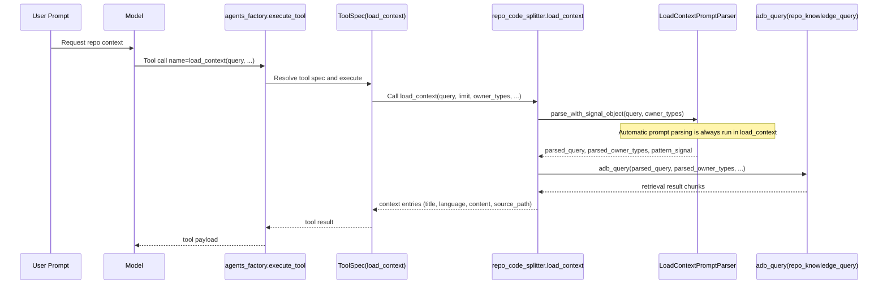

# ALDE

This repository contains the **AI IDE v1756** project (Python + PySide6/Qt) with a modular backend (RAG + agent workflows) and a local packaging setup.

## ⚠️ Important: API Key Security

**Before running this project:**
1. Copy `ALDE/ALDE/.env.example` to `ALDE/ALDE/.env`
2. Add your OpenAI API key to `.env`
3. **NEVER commit `.env` files to Git**

The `.gitignore` is pre-configured to protect your keys. For additional security, install the pre-commit hook:

```bash
bash scripts/install-hooks.sh
```

See [SECURITY.md](SECURITY.md) for detailed security guidelines.

## Quickstart

If you cloned without submodules, initialize them first:

```bash
git submodule update --init --recursive
```

Create a virtualenv and install editable:

```bash
python -m venv .venv
source .venv/bin/activate
pip install -e .
```

Run the app entrypoint:

```bash
python -m ALDE.ALDE.alde
```

### Optional Runtime Tuning: Router Parallel Branches

The router can execute multiple `route_to_agent` branches in parallel and merge them deterministically.
This mode is opt-in and remains disabled by default.

Environment variables:

- `ALDE_ROUTER_BRANCH_PARALLEL_ENABLED` (`0|1`, default: `0`)
- `ALDE_ROUTER_BRANCH_PARALLEL_WORKERS` (`1..16`, default: `4`)
- `ALDE_ROUTER_BRANCH_TIMEOUT_SECONDS` (`0.1..600`, default: `30.0`)
- `ALDE_ROUTER_BRANCH_HARD_TIMEOUT_ENABLED` (`0|1`, default: `0`)

Recommended presets:

```bash
# Quick load (balanced profile)
source scripts/router_parallel_presets.env.example

# Quick load (strict-timeout profile)
source scripts/router_parallel_presets_strict.env.example

# Balanced local development
export ALDE_ROUTER_BRANCH_PARALLEL_ENABLED=1
export ALDE_ROUTER_BRANCH_PARALLEL_WORKERS=2
export ALDE_ROUTER_BRANCH_TIMEOUT_SECONDS=30
export ALDE_ROUTER_BRANCH_HARD_TIMEOUT_ENABLED=0

# Strict timeout mode (hard kill timed-out branches)
export ALDE_ROUTER_BRANCH_PARALLEL_ENABLED=1
export ALDE_ROUTER_BRANCH_PARALLEL_WORKERS=4
export ALDE_ROUTER_BRANCH_TIMEOUT_SECONDS=10
export ALDE_ROUTER_BRANCH_HARD_TIMEOUT_ENABLED=1
```

When hard-timeout mode is enabled, timed-out branches are terminated via subprocess control.
For runtime telemetry fields and snapshot projection details, see `ALDE/alde/QUICKSTART.md`.

## Why it may look "incomplete"

This repo is cleaned for **public reference**: local/private runtime artifacts (PDFs, vector stores, histories, caches) are intentionally not tracked.

To bootstrap a fresh clone with an empty-but-valid local state, run:

```bash
python scripts/bootstrap_local_state.py
```

Then set your `OPENAI_API_KEY` in `ALDE/ALDE/.env` (this file stays ignored).


## Repo hygiene (public reference)

This repo uses an `AppData/` folder for local runtime state (history, vector stores, caches, generated files). These are intentionally **ignored** for a clean, linkable reference repo.

See `ALDE/ALDE/AppData/README.md` for what is tracked vs ignored.

If you need a clean starting point for local runs, use:
- `dispatcher_doc_db.example.json`
- `ALDE/ALDE/db.example.json`

Copy them to `dispatcher_doc_db.json` / `db.json` locally if needed (these copies remain ignored).

## Architecture

The current agent runtime is documented from three complementary angles:

Migration note:
- The runtime manifest surface is now limited to `_xplaner_xrouter` and `_xworker`.
- Execution specialization is selected through `job_name` instead of switching between multiple specialist manifest agent names.

- `ALDE/ARCHITECTURE_REFACTOR.md` describes the current manifest-driven runtime model and the remaining refactor direction.
- `ALDE/AGENT_SEQUENCE_STATE_DIAGRAM.md` captures the current routing and tool-call sequence/state model.
- `ALDE/AUTONOMOUS_MULTI_AGENT_ROADMAP.md` describes the future adaptive learning evolution on top of that runtime.
- `ALDE/TARGET_ARCHITECTURE.md` describes the intended runtime layering and phase-1 event/metrics scaffolding.
- `ALDE/REQUEST_RESPONSE_HANDOFF_FLOW.md` captures the request, tool, and handoff flow with Mermaid and ASCII fallback.

Use these documents together when changing agent configuration, routing, or workflow structure.

For orientation:
- Current runtime source of truth: `ALDE/alde/agents_config.py`
- Current runtime behavior reference: `ALDE/ARCHITECTURE_REFACTOR.md` and `ALDE/AGENT_SEQUENCE_STATE_DIAGRAM.md`
- Target runtime layering reference: `ALDE/TARGET_ARCHITECTURE.md`
- Request and handoff flow reference: `ALDE/REQUEST_RESPONSE_HANDOFF_FLOW.md`
- Future learning/runtime evolution: `ALDE/AUTONOMOUS_MULTI_AGENT_ROADMAP.md`
- Historical cleanup note: `ALDE/WORKFLOW_FIXES.md`

## Retrieval Glossary

- `repo_knowledge_query`: Primary low-level retrieval tool for indexed repository knowledge (chunk/result oriented output).
- `load_context`: Primary high-level retrieval tool for IDE/runtime context attachment (returns normalized context entries).
- `load_repo_context_for_ide_agent`: Backward-compatible alias to `load_context`.
- `memorydb`/`vectordb`: Legacy retrieval path. Not default in runtime routing; only used on explicit opt-in (for example via `use_legacy_vector_tools=true`).
- Query rewrites: Applied only when explicitly enabled (`rewrite_query=true`). Without this flag the original user query is used unchanged.

## Retrieval Call Sequence


